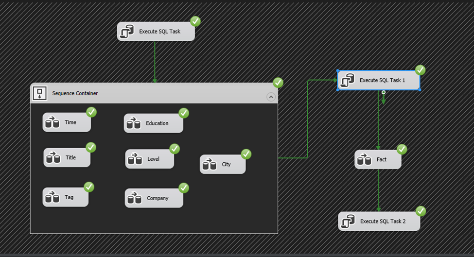
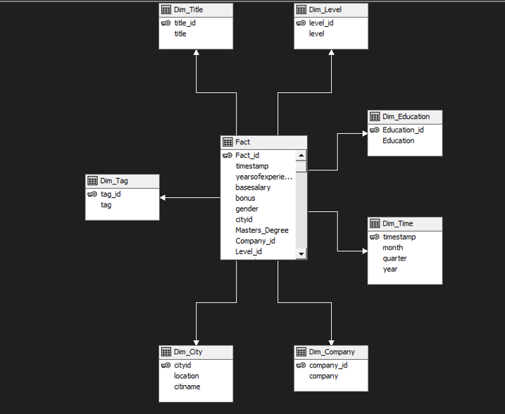

# OLAP-for-DataScience-Salary

## Report
|Full name|Role|
|:--:|:--:|
| Nguyen Hoang Long| Leader |
| Dang Thi Tuong Vy| Member |
# Table of Content
1. [Introduction](#1-Introduction)
2. [SSIS](#2-SSIS)
3. [SSAS](#3-SSAS)
4. [DataMining](#4-DataMining)

## Introduction
Online Analytical Processing is software for performing multidimensional analysis at high speeds on large volumes of data from a data warehouse, data mart, or some other unified, centralized data store.
in this case we use Dataset about DataScience Salary to analyze.
This dataset include more than 50000 records, each record contain 29 columns like salary, title, tag, timestamp, ...
We collected this dataset from [Here](https://www.kaggle.com/datasets/jackogozaly/data-science-and-stem-salaries)

## SSIS
Based on the Data we collected we decide to devide our data into seven Dimentions
+ Company
+ Title
+ Tag
+ Time
+ City
+ Education
+ Level

Then we have to build each Data pipeline for each dimention

Then we do the same for other columns

Finally, we have a system like this. Oh, and it also depends on what system you want to design.
but this is one way to reference.

Remember to change datatype when you load data to flat file connection
## SSAS
here is picture of schema\\

## DataMining
